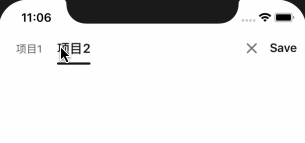

# TCSegmentControl
A simple beauty segment control.

## Usage

```objc
_segmentControl = [[TCSegmentControl alloc] initWithFrame:CGRectMake(12, 44.0, 220, 44)];
_segmentControl.delegate = self;
_segmentControl.items = @[@"项目1", @"项目2"];
_segmentControl.autoAdjustWidth = YES;
_segmentControl.bounces = NO;
TCSegmentTheme theme = [_segmentControl defaultSegmentTheme];
theme.itemBackgroundColor = [UIColor whiteColor];
theme.itemSelectedBackgroundColor = [UIColor whiteColor];
theme.itemTextColor = [UIColor blackColor];
theme.itemSelectedTextColor = [UIColor blackColor];
theme.sliderColor = [UIColor blackColor];
_segmentControl.theme = theme;
```

## Screen Shot

